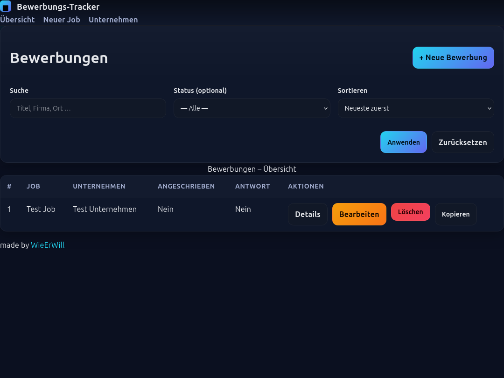

# Bewerbungs-Tracker (local, offline)

Ein schlanker, lokal laufender Tracker für Bewerbungen - ideal, um Jobs, Unternehmen und Kontakte **ohne Server** zu verwalten.
Modernes UI, sichere lokale DB, komfortable Formulare, Markdown-Notizen und sinnvolle Felder (Gehalt, Work-Mode, Seniorität u.v.m.).



## Features

- **Jobs verwalten**
  - Neu anlegen, bearbeiten, löschen
  - Status-Toggles: _angeschrieben_ / _Antwort erhalten_
  - Zuordnung genau eines Unternehmens & optional eines Kontakts
  - Gehaltsspanne (von/bis), Zielgehalt, Währung/Zeitraum
  - Meta: Work-Mode (onsite/hybrid/remote), Remote-Anteil, Seniorität, Anstellungs- & Vertragsart
  - Startdatum, Frist, Quelle/Link, Bewerbungs-Kanal, Referral
  - Beschreibung & Notizen als Markdown

- **Unternehmen & Kontakte**
  - Unternehmen separat anlegen
  - Kontaktpersonen je Unternehmen
  - Nützliche Felder/Links: Website, LinkedIn, Glassdoor, StepStone, Hiring-Page, Branche, Größe, Karriere-E-Mail, Telefon, weitere Links

- **UI/UX**
  - Saubere Tabellen, Karten, Badges, moderne Buttons
  - Startseite mit Suche / Filter / Sortierung
  - Markdown-Rendering

- **Technik**
  - TypeScript
  - SQLite Datei-DB, keine Server, keine Migration nötig
  - Express + Pug, `better-sqlite3`, `morgan`

## Projektstruktur

```
├─ database/               # SQLite-Datei
├─ public/                 # Static assets (CSS, Icons, ...)
├─ views/                  # Pug Views (index, new, edit, detail, ...)
└─ src/
   ├─ index.ts             # App-Bootstrap
   ├─ database.ts          # SQLite öffnen, PRAGMA, Schema
   ├─ statements.ts        # SQL-Wrapper
   ├─ helpers.ts           # Mapper: Request<->Record, Row<->ViewModel
   ├─ routes.ts            # Alle Routen
   └─ markdown.ts          # Markdown render
```

## Schnellstart (mit pnpm)

Voraussetzungen: Node ≥ 18, pnpm installiert.

```bash
# 1) Dependencies
pnpm install

# 2) Entwicklung (Hot-Reload via tsx)
pnpm dev
# -> Server: http://127.0.0.1:8080

# 3) Produktion (build + start)
pnpm build
pnpm start
```

Keine zusätzliche Konfiguration nötig. Die SQLite-Datei wird automatisch unter `database/jobs.db` angelegt.

## Konfiguration

Standardwerte:

- Host: `127.0.0.1`
- Port: `8080`
  -> per `PORT`/`IP` überschreibbar (`pnpm start` liest Env Vars).

## Contribution Guide

Beiträge sind willkommen! Vorschlag:

1. **Issue** aufmachen (Bug/Feature, kurzer Kontext).
2. **Branch** erstellen (z. B. `feat/pagination`).
3. **Entwickeln**
   - TypeScript strikt halten (`pnpm build` ohne Fehler)
   - Sauber typisieren, keine `any`-Leaks
   - UI: bestehendes Design nutzen (Buttons, Cards, .table, .prose)
4. **Tests** (optional, s. Roadmap)
5. **PR** mit klarer Beschreibung, Screenshots bei UI-Changes

Coding-Hinweise:

- Datenfluss: `routes` -> `statements`/`helpers` (keine SQL in Routen)
- Validierung serverseitig (z. B. `zod`) - optional, aber gern gesehen
- Markdown nur über `renderMarkdown` in Views ausgeben

## Roadmap

- [x] TypeScript-Refactor, modulare Struktur in `src/`
- [x] SQLite (serverlos), WAL, Foreign Keys
- [x] Jobs: CRUD, applied/answer Toggle
- [x] Unternehmen: eigene Entität (Name unique), Kontakte
- [x] Job<->Company/Contact Zuordnung per Dropdown
- [x] Markdown für Beschreibung/Notizen (safe)
- [x] Modernes UI + Light/Dark-Mode Toggle
- [x] Suche/Filter/Sort in der Übersicht
- [x] Gehalts- & Meta-Felder (Work-Mode, Seniorität, etc.)
- [x] Firmenlinks (LinkedIn/Glassdoor/StepStone/...)
- [x] Fix für Wildcard-Route (Express): Fallback via `app.use`
- [x] ESLint/Prettier Konfiguration
- [x] Clipboard Export von Jobs
- [x] Export CSV von Companies
- [x] Tests (Unit mit Vitest)
- [x] Screenshots

- [ ] Server-Validierung (z. B. `zod`) + Fehleranzeigen im UI
- [ ] Paginierung für Job-Liste
- [ ] Sortierbare Spaltenköpfe (Client)
- [ ] Prüfung: `contactId` gehört zur `companyId` beim Speichern
- [ ] Import (JSON/CSV) von Jobs/Companies

- [ ] mehr Tests (Unit mit Vitest, E2E leichtgewichtig)
- [ ] Backup/Restore der `jobs.db` (z. B. ZIP-Download)
- [ ] Datei-Anhänge (z. B. PDF CV, Anschreiben) - lokal unter `/uploads`
- [ ] Aktivitäten/Timeline pro Job (Follow-ups, Termine)
- [ ] i18n (Deutsch/Englisch Umschaltbar)
- [ ] Barrierefreiheit (A11y-Audit, ARIA Feinheiten)

## Routen & API

- `GET /jobs` – Liste/Filter/Suche

- `GET /jobs/new` – Neues Job-Formular

- `POST /jobs` – Job anlegen

- `GET /jobs/:id` – Job-Detail

- `GET /jobs/:id/edit` – Job bearbeiten

- `POST /jobs/:id` – Job aktualisieren

- `POST /jobs/:id/toggle/:field` – Status toggeln

- `DELETE /jobs/:id` – Job löschen

- `GET /companies` – Unternehmen-Liste

- `GET /companies/new` – Neues Unternehmen

- `POST /companies` – Unternehmen anlegen

- `GET /companies/:id` – Unternehmens-Detail

- `GET /companies/:id/edit` – Unternehmen bearbeiten

- `POST /companies/:id` – Unternehmen aktualisieren

- `POST /companies/:id/contacts` – Kontakt hinzufügen

- `POST /companies/:id/contacts/:contactId` – Kontakt aktualisieren

- `DELETE /companies/:id/contacts/:contactId` – Kontakt löschen

- `DELETE /companies/:id` – Unternehmen löschen _(per Method-Override)_

### REST-API (ohne Auth & ohne CSRF; lokal)

**Health**

- `GET /api/health` → `{ ok: true }`

**Jobs**

- `GET /api/jobs?q=&status=&sort=` – Liste (joined).
- `POST /api/jobs` – Job anlegen. Body Felder wie `jobTitle`, `companyId`, `contactId`, `salary…`.
- `GET /api/jobs/:id` – Detail (joined).
- `PATCH /api/jobs/:id` – Partielles Update (nur übergebene Felder).
- `DELETE /api/jobs/:id` – Löschen.
- `POST /api/jobs/:id/toggle` – Body `{ "field": "applied"|"answer" }`.
- `GET /api/jobs/:id/clipboard` – Markdown-Export (Text).

**Companies**

- `GET /api/companies` – Liste.
- `POST /api/companies` – Anlegen. Body z. B. `companyName`, `companyWebsite`, …
- `GET /api/companies/:id` – Detail inkl. Kontakte.
- `PATCH /api/companies/:id` – Partielles Update.
- `DELETE /api/companies/:id` – Löschen.
- `GET /api/companies.csv` – CSV-Export (UTF-8 BOM), Header:
  `name,website,city,linkedin,glassdoor,stepstone,size_range`
- `POST /api/companies.csv` – CSV-Import (gleiches Format; optional `id`-Spalte).
  - Deduplizierung: zuerst per `id`, sonst per `name` (CI).
  - Nur **nicht-leere** Felder überschreiben; unbekannte Spalten wandern in Notizen.
  - Antwort: `{ ok, summary: { created, updated, skipped, errors }, details: [...] }`

**Contacts**

- `GET /api/companies/:id/contacts` – Kontakte eines Unternehmens.
- `POST /api/companies/:id/contacts` – Kontakt anlegen.
- `PATCH /api/companies/:id/contacts/:contactId` – Kontakt aktualisieren.
- `DELETE /api/companies/:id/contacts/:contactId` – Kontakt löschen.

**Importer**

- `POST /api/import/glassdoor` – Body `{ url?: string, html?: string }`
  - Lädt/parst Glassdoor-Unternehmensseite, mappt Felder (Website, Stadt, Größe, Beschreibung …).
  - Unbekanntes in Notizen.

## FAQ

**Warum SQLite?**
Robust, transaktionssicher, eine Datei, kein externer Server. Perfekt fürs private Hosting/offline.

**Warum Pug statt React?**
Schnell, leichtgewichtig, keine Build-Komplexität im Frontend nötig.

**Kann ich eigene Farben/Branding setzen?**
Ja - die Design-Tokens (CSS Variablen) stehen am Anfang von `public/styles.css`.

---

Viel Spaß beim Bewerbungen-Organisieren! 🎯
Wenn etwas holpert: Issue aufmachen - wir verbessern das in kleinen Iterationen.
